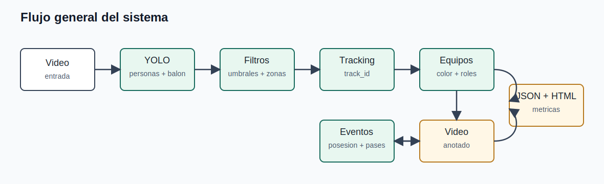
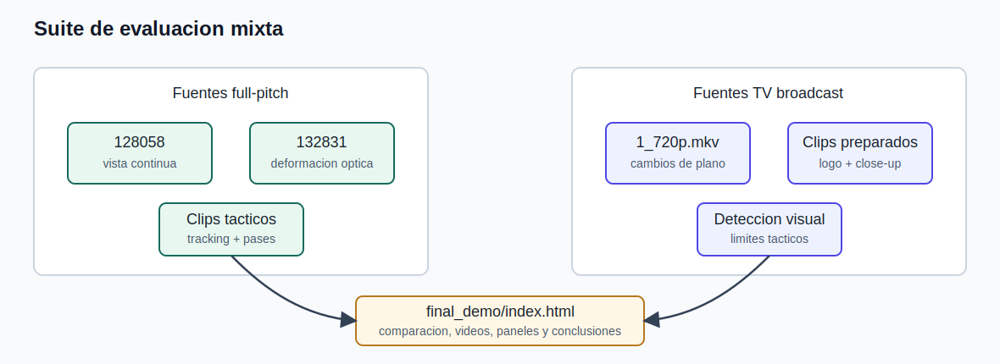
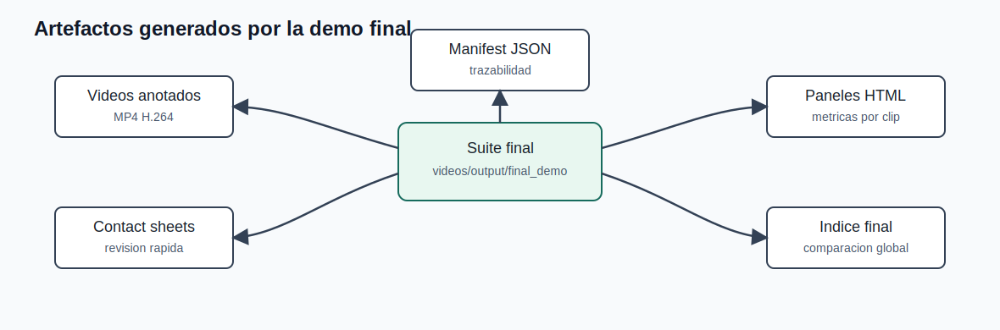
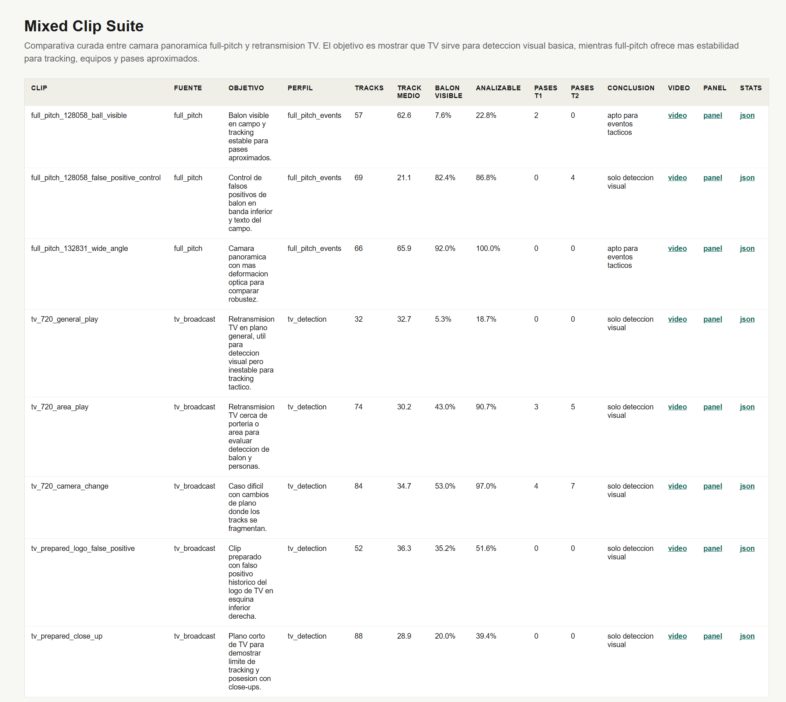
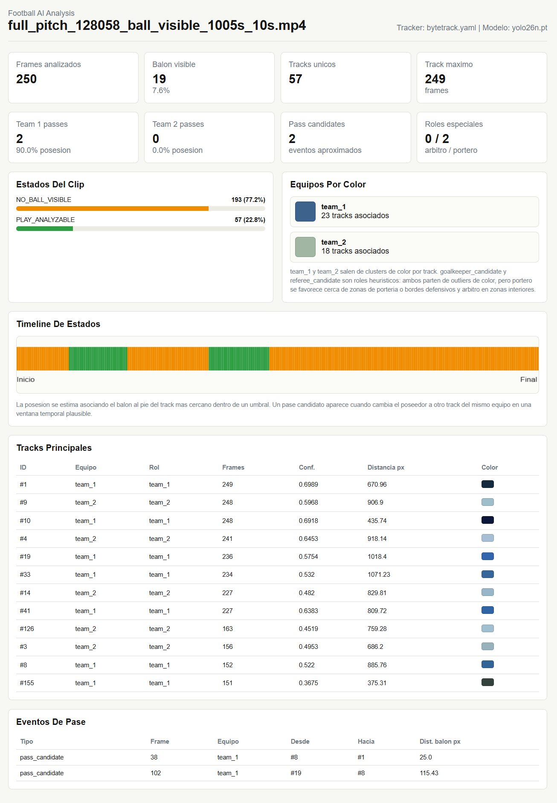
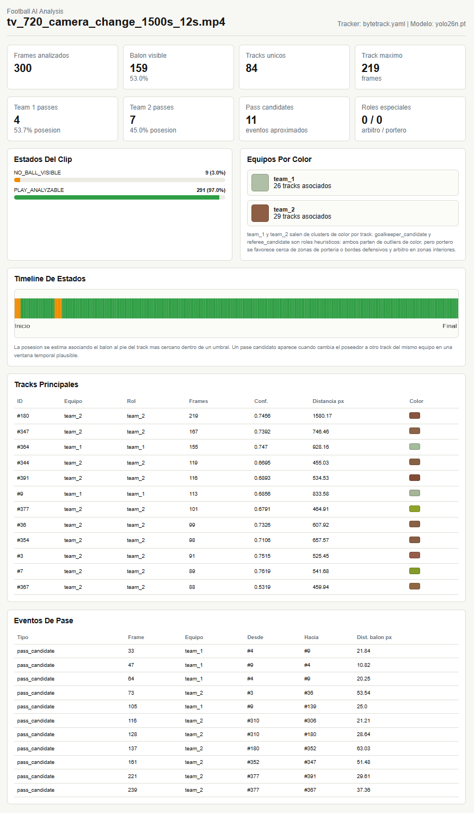
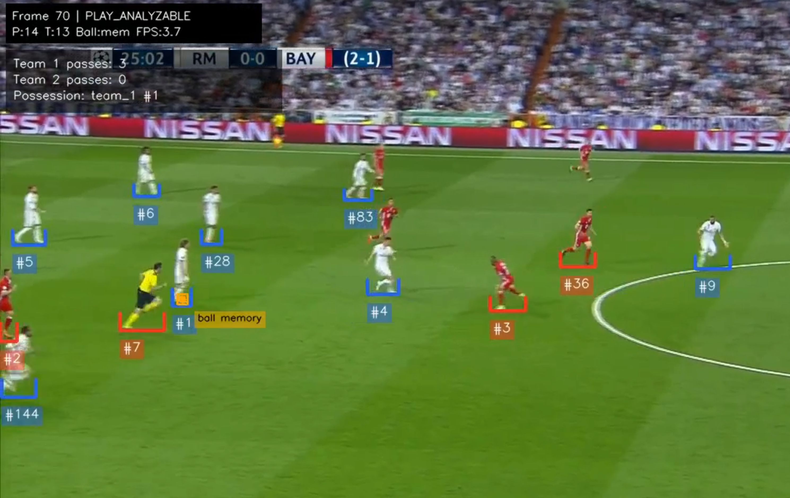
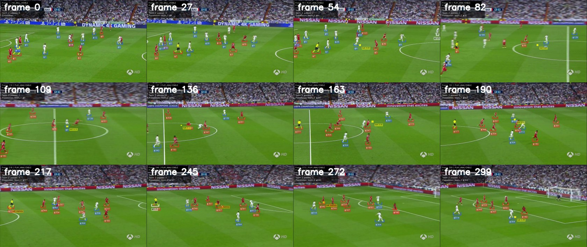

# Memoria del proyecto

# Análisis de vídeo de fútbol con inteligencia artificial

## 1. Resumen

Este proyecto desarrolla un prototipo de análisis de partidos de fútbol mediante visión artificial. El sistema recibe vídeos de entrada, detecta jugadores y balón, realiza tracking de los jugadores, agrupa equipos de forma aproximada, genera vídeos anotados y produce informes HTML con métricas del clip analizado.

El punto de partida fue el enunciado original, orientado a obtener información deportiva a partir de vídeo. Sin embargo, durante la fase inicial de investigación se detectó que el primer reto importante no era solamente aplicar un modelo de inteligencia artificial, sino disponer de diferentes tipos de vídeos y poder probar el sistema en condiciones variadas. En un caso real, un técnico o emprendedor que quisiera ofrecer análisis deportivo a clubes se encontraría con grabaciones muy distintas: retransmisiones de televisión, cámaras panorámicas, resoluciones diferentes, cambios de iluminación, deformaciones de lente, personas fuera del campo, balones en la banda o elementos gráficos que pueden confundir al detector.

Por este motivo el proyecto no se ha centrado solo en analizar un vídeo concreto, sino en construir un pequeño flujo de trabajo para preparar clips, ejecutar pruebas, comparar resultados y generar una demo técnica defendible. La solución final permite analizar una suite mixta de clips, comparar cámara panorámica de campo completo frente a retransmisión de televisión y explicar qué tipo de fuente es más adecuada para obtener métricas tácticas.

El resultado obtenido es un prototipo funcional que cumple el objetivo principal de demostrar detección, tracking, agrupación aproximada por equipo y conteo aproximado de pases por equipo. Al mismo tiempo, identifica con claridad las limitaciones actuales y deja planteado un camino de mejora hacia versiones futuras.

## 2. Introducción y justificación

Al comenzar el proyecto, la idea inicial podía parecer relativamente directa: tomar un vídeo de fútbol, aplicar un modelo de detección y extraer información como jugadores, balón, pases o eventos relevantes. Sin embargo, al empezar la investigación se comprobó rápidamente que el problema real es más amplio.

En visión artificial, el resultado depende mucho de la calidad y del tipo de imagen de entrada. No es lo mismo analizar una retransmisión de televisión, que cambia de plano constantemente, que una grabación fija donde se ve todo el campo. Tampoco es igual trabajar con un vídeo de baja resolución que con uno panorámico, con deformación de lente, con buena iluminación o con sombras. Por tanto, antes de intentar obtener métricas deportivas complejas, era necesario crear una forma ordenada de probar el sistema con distintos vídeos.

El caso de uso elegido para orientar el proyecto fue el de un emprendedor con perfil técnico que quisiera ofrecer servicios reales de análisis deportivo capturados por vídeo. En este escenario, el problema no consiste solo en ejecutar un script, sino en poder llegar a una instalación deportiva, probar distintas cámaras o fuentes de vídeo, ajustar parámetros y comprobar qué resultados son fiables.

Durante el desarrollo se identificaron dos grandes familias de vídeos:

- **Retransmisión de televisión**: suele tener buena calidad visual, planos cercanos y movimiento de cámara profesional, pero también incluye cambios de plano, zooms, primeros planos, grafismos, logotipos, repeticiones o cortes que rompen la continuidad del tracking.
- **Cámara panorámica o full-pitch**: permite ver el campo de forma continua y es más adecuada para tracking, posesión o pases, pero puede tener deformación óptica, jugadores muy pequeños, problemas de perspectiva o elementos del entorno que generan falsos positivos.

En las pruebas aparecieron problemas reales y bastante representativos: el logotipo de una televisión se confundía con el balón, letras pintadas en el césped parecían balones, había balones reales fuera del terreno de juego, personas caminando alrededor del campo y planos cortos donde el sistema no podía mantener una referencia táctica del partido.

Por todo ello, el proyecto evolucionó hacia una idea más completa: crear no solo un analizador de vídeo, sino también un pequeño framework de pruebas que permita comparar fuentes y configuraciones. Esta aproximación es interesante porque se parece más a un escenario profesional: no se trata de prometer métricas perfectas con cualquier vídeo, sino de evaluar qué entrada permite obtener datos útiles.

## 3. Objetivos del proyecto

El objetivo general del proyecto es desarrollar un prototipo capaz de analizar clips de fútbol mediante inteligencia artificial y generar resultados visuales y estadísticos comprensibles.

Los objetivos concretos trabajados han sido:

- Detectar jugadores en los frames del vídeo.
- Detectar el balón con umbrales propios.
- Clasificar si un frame es analizable o no.
- Realizar tracking de jugadores para mantener identificadores en el tiempo.
- Mostrar el `track_id` de los jugadores en el vídeo.
- Agrupar jugadores en dos equipos de forma aproximada usando el color de la camiseta.
- Detectar roles visuales especiales de forma heurística, como portero o árbitro candidato.
- Asociar el balón al jugador más cercano cuando sea posible.
- Contar pases aproximados por equipo.
- Generar un vídeo anotado con la información principal.
- Exportar métricas en formato JSON.
- Generar informes HTML para revisar cada clip.
- Crear una suite mixta de clips para comparar full-pitch y televisión.
- Preparar una demo final limpia y reproducible.

Algunos objetivos del enunciado original, como la detección fiable de goles o salidas de banda/fondo, se han dejado como evolución futura. La razón principal es que requieren una calibración del campo y una fiabilidad de detección superior a la alcanzada en esta fase. En lugar de forzar una solución poco fiable, se ha preferido centrar la entrega en los elementos que se pueden demostrar con mayor claridad.

## 4. Tecnologías utilizadas

El proyecto se ha desarrollado principalmente en Python, utilizando librerías y herramientas habituales en visión artificial.

Las tecnologías principales son:

- **Python**: lenguaje principal del proyecto.
- **OpenCV**: lectura de vídeo, escritura de vídeo, procesamiento de frames y dibujo de anotaciones.
- **Ultralytics YOLO**: modelo de detección usado para localizar personas y balón.
- **ByteTrack / BoT-SORT**: trackers disponibles a través de Ultralytics para mantener identificadores de jugadores en el tiempo.
- **NumPy**: operaciones numéricas y manejo de imágenes.
- **PyYAML**: lectura de configuraciones en YAML.
- **FFmpeg**: conversión de los vídeos finales a H.264/yuv420p para que funcionen correctamente en navegadores.
- **HTML, CSS y JavaScript**: generación de paneles visuales para revisar resultados.
- **Git y GitHub**: control de versiones, publicación del repositorio y release final.

El modelo utilizado es un modelo YOLO ya entrenado. En esta fase del proyecto no se ha entrenado un modelo propio. Esto es importante porque el entrenamiento requeriría preparar un dataset con imágenes etiquetadas, dividirlo correctamente en train, validation y test, entrenar el modelo y evaluar sus resultados. Ese proceso queda planteado dentro del roadmap futuro.

## 5. Instalación y preparación del entorno

El proyecto está pensado para ejecutarse en un entorno local de Python. Durante el desarrollo se ha utilizado un entorno Conda llamado `football-ai`.

### 5.1. Descargar el proyecto desde GitHub

El primer paso es clonar el repositorio:

```powershell
git clone https://github.com/LlinaresOmar/ProyectoIA_VisionFutbol.git
cd ProyectoIA_VisionFutbol
```

También puede descargarse el proyecto como ZIP desde GitHub, aunque para desarrollo es recomendable usar Git.

### 5.2. Crear o activar el entorno Python

En el equipo usado durante el desarrollo, el Python del entorno era:

```powershell
C:\Users\javie\miniconda3\envs\football-ai\python.exe
```

Para comprobar que el entorno está funcionando:

```powershell
C:\Users\javie\miniconda3\envs\football-ai\python.exe -c "import torch, ultralytics; print(torch.__version__); print(torch.cuda.is_available()); print(ultralytics.__version__)"
```

El proyecto se ha ejecutado principalmente en CPU. Esto hace que los análisis sean más lentos, pero permite demostrar que el sistema funciona incluso sin una tarjeta gráfica dedicada. En un escenario profesional, disponer de GPU NVIDIA con CUDA, o explorar aceleración mediante OpenVINO en hardware Intel, sería una mejora importante para reducir tiempos de procesamiento.

### 5.3. CPU y GPU

Durante las pruebas se trabajó con un equipo portátil con CPU Intel y gráfica integrada Intel UHD. Aunque Windows muestra memoria compartida para la GPU, el cuello de botella principal del proyecto es la inferencia del modelo YOLO. En la configuración actual, PyTorch no está usando esa GPU integrada para acelerar la detección.

Esto significa que:

- El sistema funciona en CPU.
- Los tiempos de análisis pueden ser altos.
- Para ejecutar muchas pruebas conviene usar clips cortos.
- Una GPU compatible aceleraría mucho el proceso.
- La conversión final de vídeo con FFmpeg no es el principal cuello de botella.

Por esta razón, la suite final usa clips cortos de 10 a 20 segundos. Es una decisión práctica: permite probar muchos escenarios sin esperar demasiado tiempo.

## 6. Datos y vídeos utilizados

Una parte importante del proyecto ha sido conseguir y organizar vídeos de entrada. Se han utilizado varios tipos de fuente:

- Clips preparados de retransmisión de televisión.
- Vídeos de SoccerNet en distintas calidades.
- Vídeos panorámicos de campo completo.
- Clips recortados manualmente o mediante scripts.

El proyecto no entrena un modelo propio, por lo que no utiliza todavía un dataset dividido en train, validation y test. Aún así, esta idea es importante:

- **Train**: datos usados para entrenar un modelo.
- **Validation**: datos usados para ajustar parámetros durante el entrenamiento.
- **Test**: datos separados que sirven para evaluar si el modelo generaliza.

En este proyecto se ha trabajado más bien con una batería de pruebas o suite de evaluación. La idea es parecida a un conjunto de test funcional: se eligen clips representativos y se comprueba cómo se comporta el sistema. Para una versión futura, sería muy interesante crear un dataset etiquetado propio con ejemplos de jugadores, balón, porteros, árbitros y eventos.

## 7. Funcionamiento general del sistema

El flujo de trabajo del sistema puede resumirse así:



1. Se recibe un vídeo de entrada.
2. Se procesa frame a frame.
3. YOLO detecta personas y balón.
4. Se aplican umbrales separados para persona y balón.
5. Se filtran falsos positivos conocidos del balón.
6. Se realiza tracking de jugadores.
7. Se asigna un `track_id` a los jugadores detectados.
8. Se calcula un color medio de camiseta por track.
9. Se agrupan tracks en dos equipos aproximados.
10. Se asocia el balón al jugador más cercano si está dentro de un umbral.
11. Se generan eventos aproximados de pase cuando cambia el poseedor dentro del mismo equipo.
12. Se escribe un vídeo anotado.
13. Se genera un JSON con métricas.
14. Se genera un panel HTML para revisar resultados.

El vídeo anotado incluye marcas visuales sobre jugadores, balón, estado del frame, pases acumulados y posesión estimada. Para mejorar la claridad visual, las etiquetas de jugadores muestran solo el identificador `#track_id`, evitando mostrar continuamente la confianza de cada detección.

## 8. Configuración del sistema

El sistema es configurable porque durante el desarrollo se vio que no existe una única configuración válida para todos los vídeos. Algunos parámetros importantes son:

- Tamano de entrada del modelo (`imgsz`).
- Confianza mínima del modelo.
- Confianza mínima para personas.
- Confianza mínima para balón.
- Tracker utilizado.
- Número mínimo de jugadores para considerar un frame analizable.
- Ratio mínimo de césped.
- Umbral para detectar primeros planos.
- Zonas ignoradas donde no debe aceptarse el balón.
- Polilíneas para excluir zonas fuera del terreno de juego.
- Transparencia y posicion de etiquetas.

Esta configuración es clave para un caso real. Un técnico que instalase cámaras en distintos campos se encontraría con condiciones muy variables: distinta altura de cámara, distinta iluminación, césped natural o artificial, sombras, publicidad, personas fuera del campo, banquillos, balones en la banda o marcas en el suelo. En el proyecto se han observado varios de estos problemas de forma práctica.

Un ejemplo claro fue una letra pintada en el campo, dentro del texto "University of Tsukuba", que se confundía con un balón. Otro ejemplo fue el logotipo de una cadena de televisión en la esquina inferior derecha, que también generaba falsos positivos. Estos casos justifican que el sistema tenga filtros configurables por regiones y por tipo de fuente.

## 9. Tracking, equipos y pases

Una mejora importante respecto a una detección simple es el tracking. Detectar personas en cada frame permite saber que hay jugadores, pero no permite saber si el jugador de un frame es el mismo que aparece unos segundos después. Para obtener métricas deportivas es necesario mantener una identidad temporal.

El proyecto utiliza trackers como ByteTrack o BoT-SORT para asignar un `track_id` a los jugadores. Esto permite mostrar etiquetas como `#12` y calcular métricas como:

- cuantos frames se ha visto un jugador;
- que distancia aproximada ha recorrido en pixeles;
- que color medio de camiseta tiene;
- que jugador estaba cerca del balón;
- si un posible pase ha ido de un track a otro.

La agrupación de equipos se hace de forma heurística mediante el color medio de la camiseta. El sistema intenta separar los tracks en `team_1` y `team_2`. No es perfecto, pero permite construir una primera aproximación al conteo de pases por equipo.

El conteo de pases también es aproximado. El sistema busca el jugador más cercano al balón y considera que existe un pase candidato cuando el poseedor cambia a otro jugador del mismo equipo dentro de una ventana temporal plausible. Esto no equivale a una detección profesional de pases, pero permite demostrar el flujo completo: detección, tracking, asociación balón-jugador y generación de eventos.

## 10. Comparación de fuentes: televisión frente a full-pitch

Uno de los resultados más importantes del proyecto es la comparación entre distintos tipos de vídeo.

La retransmisión de televisión es visualmente atractiva y suele tener buena resolución, pero no está pensada para análisis táctico automático. Cambia de plano, enfoca a jugadores concretos, muestra repeticiones, realiza zooms y pierde la continuidad de todos los jugadores del campo. Esto provoca que los tracks se fragmenten y que el sistema no pueda mantener una visión estable del partido.

La cámara panorámica de campo completo es menos espectacular visualmente, pero resulta mucho más útil para métricas tácticas. Al ver el campo de forma continua, el sistema puede seguir más jugadores a la vez y mantener mejor el contexto del juego. Por eso, en la demo final, los clips full-pitch son los más adecuados para defender tracking y pases aproximados.

La conclusión es que no todos los vídeos sirven para todo. La televisión puede servir para demostrar detección visual básica, pero una instalación profesional que busque métricas tácticas debería utilizar cámaras fijas, elevadas y calibradas.

## 11. Suite final de pruebas

Para ordenar las pruebas se creó una suite mixta definida en `config/clip_suite.yaml`. Esta suite incluye clips full-pitch y clips de retransmisión TV. Cada clip tiene un objetivo concreto, por ejemplo:



- balón visible en campo;
- control de falsos positivos;
- cámara panorámica con deformación;
- plano general de televisión;
- zona de area o portería;
- cambio de cámara;
- falso positivo historico del logo de TV;
- primer plano.

La suite se ejecuta con:

```powershell
C:\Users\javie\miniconda3\envs\football-ai\python.exe tools/run_clip_suite.py `
  --suite config/clip_suite.yaml `
  --output-dir videos/output/final_demo `
  --clips-dir videos/clips/final_demo `
  --overwrite
```

La salida principal es:

```text
videos/output/final_demo/index.html
```

Este índice HTML permite navegar por los resultados de la demo final. Además, cada clip tiene:

- vídeo anotado;
- JSON de métricas;
- informe HTML propio;
- conclusión automática;
- datos de balón visible, tracks, frames analizables y pases.

También se generó una herramienta de contact sheets:

```powershell
C:\Users\javie\miniconda3\envs\football-ai\python.exe tools/create_contact_sheet.py `
  --input videos/output/final_demo `
  --output-dir videos/output/final_demo/contact_sheets `
  --overwrite
```

Estas imágenes permiten ver de un vistazo varios momentos de cada vídeo sin tener que reproducirlo completo.

## 12. Herramientas desarrolladas

Además del script principal de análisis, durante el proyecto se han creado varias herramientas auxiliares. Esta parte es importante porque el resultado final no depende solo de un modelo de IA, sino de un flujo completo de trabajo.

Las herramientas principales son:

- `video_analise.py`: script principal. Analiza un clip, detecta personas y balón, aplica tracking, genera el vídeo anotado y exporta métricas JSON.
- `tools/run_clip_suite.py`: ejecuta una suite completa de clips definidos en YAML. Es la herramienta central de la demo final porque permite comparar fuentes de vídeo diferentes de forma repetible.
- `tools/create_video_clips.py`: permite recortar clips cortos desde vídeos largos. Fue útil para generar pruebas rápidas sin procesar partidos completos.
- `tools/generate_report_panel.py`: convierte un JSON de métricas en un informe HTML visual.
- `tools/create_contact_sheet.py`: genera mosaicos de imágenes a partir de los vídeos anotados. Sirve para revisar de un vistazo si una salida es buena o no.
- `tools/run_full_pitch_test_batch.py`: permite ejecutar baterías de pruebas sobre vídeos panorámicos y comparar configuraciones.
- `tools/compare_trackers.py`: herramienta de apoyo para comparar trackers como ByteTrack y BoT-SORT.
- `tools/serve_output.py`: levanta un servidor local para abrir los informes HTML y reproducir los vídeos desde Chrome sin problemas de seguridad del protocolo `file://`.

Estas herramientas hacen que el proyecto sea más fácil de probar, repetir y explicar. En lugar de tener una única ejecución manual, se puede lanzar una suite completa, revisar resultados, generar paneles y preparar capturas para la memoria o la defensa.

### 12.1. Contact sheets

Los contact sheets son imágenes compuestas por varios frames del mismo vídeo. En este proyecto se usan para revisar rápidamente los vídeos anotados sin tener que reproducir cada clip completo.

Por ejemplo, para un vídeo de salida se toman varios frames repartidos a lo largo del clip y se colocan en una única imagen. Esto permite comprobar rápidamente:

- si los jugadores aparecen marcados;
- si el balón se detecta;
- si las etiquetas son legibles;
- si hay falsos positivos;
- si un clip de televisión cambia mucho de plano;
- si una cámara panorámica mantiene mejor la continuidad.

En la demo final se generaron contact sheets para los 8 vídeos analizados. Están en:

```text
videos/output/final_demo/contact_sheets
```

**Captura recomendada para la memoria:** insertar aqui una imagen de contact sheet full-pitch, por ejemplo:

```text
videos/output/final_demo/contact_sheets/full_pitch_128058_ball_visible_analysed_contact_sheet.jpg
```

**Captura recomendada para comparar:** insertar también una contact sheet de televisión, por ejemplo:

```text
videos/output/final_demo/contact_sheets/tv_720_camera_change_analysed_contact_sheet.jpg
```

Esta comparación visual ayuda a explicar por que la fuente full-pitch es más estable para métricas tácticas, mientras que la televisión sirve mejor para detección visual puntual.

## 13. Artefactos generados

La ejecución del sistema genera varios artefactos:



- **Vídeos anotados**: muestran detecciones, identificadores, balón y contadores.
- **JSON de métricas**: contienen datos estructurados para cada clip.
- **Paneles HTML**: presentan las métricas de forma visual.
- **Índice comparativo**: resume todos los clips de la suite.
- **Contact sheets**: mosaicos de imágenes para revisar rápidamente los resultados.

Los vídeos finales se convierten a H.264/yuv420p para que puedan reproducirse correctamente en navegadores como Chrome. Esto fue necesario porque OpenCV genera inicialmente MP4 con codec `mp4v`, que no siempre se reproduce bien desde un informe HTML.

Para abrir la demo final mediante servidor local:

```powershell
C:\Users\javie\miniconda3\envs\football-ai\python.exe tools/serve_output.py `
  --directory videos/output/final_demo
```

Después se puede acceder desde:

```text
http://127.0.0.1:8765/index.html
```

### 13.1. Capturas de artefactos

Las capturas más útiles para obtener una visión rápida de los resultados son:

1. **Índice comparativo final**

   Esta captura permite mostrar que el proyecto compara varios clips y fuentes de vídeo en un único panel.

   

2. **Panel HTML de un clip full-pitch**

   Esta captura muestra métricas como frames analizables, balón visible, tracks, equipos y pases candidatos.

   


3. **Panel HTML de un clip de televisión**

   Sirve para explicar que la televisión puede detectar jugadores y balón, pero no mantiene igual de bien la continuidad táctica.

   

4. **Frame de vídeo anotado**

   Captura de ejemplo de vídeo anotado.

   

5. **Contact sheet**

   Una contact sheet resume visualmente un clip completo y es especialmente útil porque permite entender el comportamiento del sistema de un vistazo.

   

## 14. Resultados obtenidos

El proyecto consigue generar una demo final con varios clips de prueba. En los vídeos panorámicos se observa mejor continuidad de jugadores y mayor utilidad para eventos tácticos. En los vídeos de televisión se detectan jugadores y balón en muchos frames, pero la estabilidad de los tracks es menor y por tanto las métricas tácticas son menos fiables.

Los resultados confirman la hipótesis principal del proyecto: la fuente de vídeo condiciona enormemente lo que se puede medir. No basta con tener un buen detector. Para obtener datos deportivos útiles es necesario controlar la captura, usar una cámara adecuada y ajustar parámetros según el entorno.

El sistema también consigue mostrar pases aproximados por equipo. Esta parte debe interpretarse como una prueba de concepto, no como una estadística oficial. Aún así, es suficiente para demostrar que el pipeline puede evolucionar hacia métricas deportivas más avanzadas.

Una forma sencilla de presentar los resultados en la defensa es apoyarse en tres elementos visuales:

- el índice final, para mostrar la comparación global;
- un vídeo full-pitch, para mostrar tracking y pases;
- un vídeo de televisión, para mostrar las limitaciones de una fuente con cambios de plano.

De este modo, el tribunal puede ver tanto lo que el sistema hace bien como las razones técnicas por las que algunos escenarios son más difíciles.

## 15. Limitaciones

El proyecto tiene varias limitaciones importantes:

- No se ha entrenado un modelo propio.
- La detección del balón puede fallar con objetos parecidos.
- El árbitro y el portero se detectan solo de forma heurística.
- La agrupación por equipos depende del color de camiseta y puede confundirse.
- Los pases son candidatos aproximados, no eventos confirmados.
- No existe calibración métrica real del campo.
- Las distancias recorridas se calculan en pixeles, no en metros.
- La televisión no permite tracking táctico estable por sus cambios de plano.
- No se han implementado goles ni salidas de campo/fondo.

Estas limitaciones no invalidan el proyecto. Al contrario, ayudan a explicar que se ha construido un prototipo realista y que se han identificado claramente los pasos necesarios para convertirlo en una solución más robusta.

## 16. Roadmap futuro

Las mejoras futuras más importantes serían:

- Crear un dataset propio etiquetado.
- Separar datos de train, validation y test.
- Entrenar o ajustar un modelo específico para fútbol.
- Mejorar la detección del balón.
- Entrenar clases específicas para árbitro y portero.
- Mejorar la asociación balón-jugador.
- Calibrar el campo para convertir pixeles en metros.
- Calcular distancias recorridas reales.
- Mejorar el conteo de pases con validación temporal y espacial.
- Detectar goles y salidas de campo.
- Integrar varias cámaras fijas en una instalación real.
- Crear una interfaz para que un técnico pueda ajustar parámetros sin tocar código.

En un escenario profesional, la instalación ideal sería una o varias cámaras fijas elevadas, con visión continua del campo, calibración por instalación y una fase previa de pruebas con clips cortos. Este proyecto ya deja preparada la parte de evaluación y comparación que permitiría elegir la mejor configuración para cada campo.

## 17. Conclusión

El proyecto ha permitido desarrollar un prototipo completo de análisis de fútbol mediante visión artificial. La solución no se limita a ejecutar un modelo de detección, sino que construye un flujo de trabajo completo: preparación de clips, análisis automático, tracking, agrupación de equipos, conteo aproximado de pases, generación de vídeos anotados e informes HTML.

La principal conclusión es que la calidad y el tipo de fuente de vídeo son decisivos. Las retransmisiones de televisión son útiles para detección visual, pero no son la mejor opción para métricas tácticas estables. Las grabaciones panorámicas de campo completo, aunque tengan sus propios problemas, son mucho más adecuadas para seguir jugadores y analizar eventos.

Desde el punto de vista técnico, el proyecto demuestra integración de inteligencia artificial, procesamiento de vídeo, configuración por YAML, generación de informes, control de versiones y publicación en GitHub. Desde el punto de vista práctico, plantea una aproximación realista para un futuro servicio de análisis deportivo basado en vídeo.

Por tanto, el valor principal del proyecto no está solo en las métricas obtenidas, sino en haber construido una base funcional y evaluable sobre la que se pueden seguir desarrollando nuevas capacidades.
